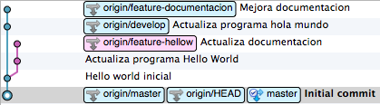

# Homework

## Instrucciones

Generar un histórico lineal del repo de ejemplo. Para ello, deberían:

* Hacer un **[fork del repo][1]** 
* Corregir el histórico para lograr un grafo lineal (utilizar `rebase`, `merge` y `commit` según sea necesario) 
* Una vez que cuenten con el grafo lineal, **[hacer un pull request][2]** para proponer una respuesta al problema

[1]: https://help.github.com/articles/fork-a-repo
[2]: https://help.github.com/articles/using-pull-requests#initiating-the-pull-request